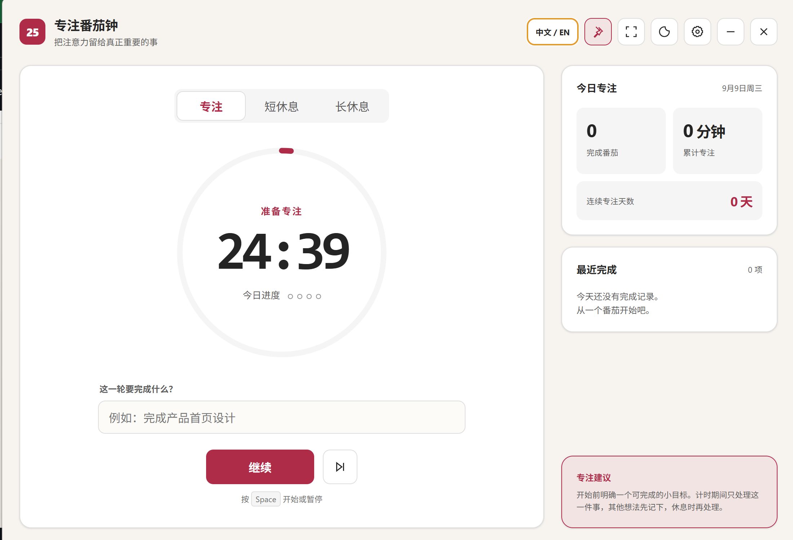
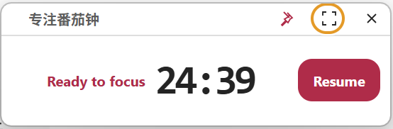

# 专注番茄钟

[English](README_EN.md)

一款适用于 Windows 和 macOS 的轻量桌面番茄钟，支持始终置顶和迷你悬浮模式。



## 迷你悬浮窗

迷你窗口可始终显示在其他工作窗口上方，方便随时查看剩余时间。



## 功能特点

- 始终置顶的计时窗口
- 紧凑迷你悬浮模式
- 中文与英文界面
- 每天完成 4 个专注即可点亮能量日历，按自然月记录
- 专注、短休息和长休息循环
- 本地任务历史与每日统计
- Windows 系统托盘和 macOS 菜单栏控制
- 全局快捷键

## 快捷键

| 操作 | Windows | macOS |
| --- | --- | --- |
| 显示或隐藏 | `Ctrl+Alt+P` | `Command+Option+P` |
| 切换迷你模式 | `Ctrl+Alt+M` | `Command+Option+M` |
| 开始或暂停 | `Space` | `Space` |

## 本地开发

```text
npm install
npm start
```

## 构建

```text
npm run build:windows
npm run build:macos
```

Windows 安装包需在 Windows 构建，macOS 安装包需在 macOS 构建。GitHub Actions
会从同一份源代码自动构建两个平台。

计时记录仅保存在本地设备。
