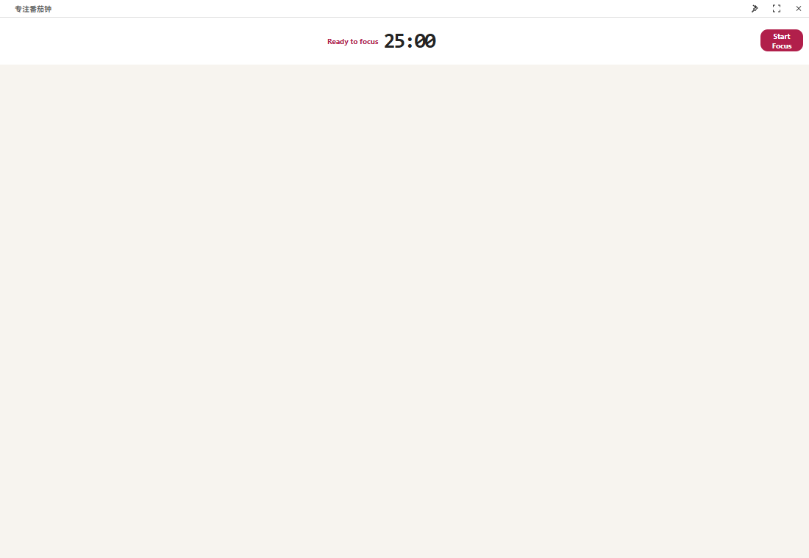
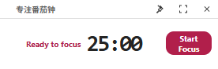

# Pomodoro Focus Desktop

A compact desktop Pomodoro timer for Windows and macOS.





## Features

- Always-on-top timer window
- Compact floating mode
- Chinese and English interfaces
- Focus, short-break, and long-break cycles
- Local task history and daily statistics
- System tray or menu bar controls
- Global shortcuts

## Shortcuts

| Action | Windows | macOS |
| --- | --- | --- |
| Show or hide | `Ctrl+Alt+P` | `Command+Option+P` |
| Toggle compact mode | `Ctrl+Alt+M` | `Command+Option+M` |
| Start or pause while focused | `Space` | `Space` |

## Development

```text
npm install
npm start
```

## Build

```text
npm run build:windows
npm run build:macos
```

Windows builds run on Windows. macOS builds run on macOS. GitHub Actions
builds both platforms from the same source.

Timer records remain on the local device.
